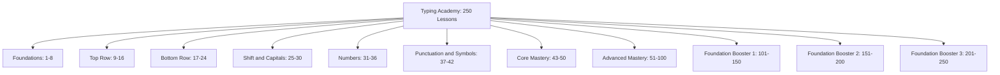
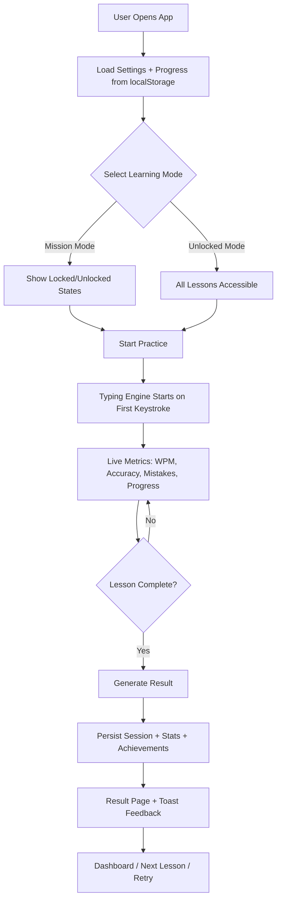

# Typing Academy

<div align="center">

A modern, lesson-driven typewriting platform with **250 structured practices**, premium UI, dual learning modes, and local-first progress analytics.

[](https://react.dev/)
[](https://vitejs.dev/)
[](https://tailwindcss.com/)
[](https://reactrouter.com/)
[](https://fkhadra.github.io/react-toastify/)
[](https://developer.mozilla.org/en-US/docs/Web/API/Window/localStorage)
[](#)
[](./LICENSE)

</div>

---

## Table of Contents

1. [Project Vision](#project-vision)
2. [Core Features](#core-features)
3. [Tech Stack](#tech-stack)
4. [Learning Modes](#learning-modes)
5. [Product Routes](#product-routes)
6. [Curriculum Map (250 Lessons)](#curriculum-map-250-lessons)
7. [System Flow Graph](#system-flow-graph)
8. [Project Architecture Map](#project-architecture-map)
9. [Getting Started](#getting-started)
10. [Run Scripts](#run-scripts)
11. [LocalStorage Data Model](#localstorage-data-model)
12. [Typing Engine Formulas](#typing-engine-formulas)
13. [UI/UX Notes](#uiux-notes)
14. [Deployment Notes](#deployment-notes)
15. [Contributing](#contributing)

---

## Project Vision

**Typing Academy** is not a random typing-test toy. It is a complete, structured typing education experience.

This app is designed to:
- teach typing from fundamentals to mastery in guided steps
- prioritize typing posture, finger placement, and rhythm
- provide measurable progress using WPM, accuracy, mistakes, and completion history
- support both progression-based learning and all-unlocked practice
- feel like a polished, premium edtech product across desktop and mobile

---

## Core Features

- **250 lesson-based practices** with progressive pedagogy
- **Dual learning modes**
  - `Mission Mode`: sequential unlock progression
  - `Unlocked Mode`: all lessons instantly available
- **Real-time typing engine**
  - active-character tracking
  - correct/incorrect highlighting
  - live WPM and accuracy
  - mistake and completion logic
- **Result workflow**
  - pass/fail-oriented feedback
  - retry and next-lesson CTAs
- **Analytics dashboard**
  - completion, averages, best performance, session history
  - lesson-wise stats + milestone achievements
- **Settings + persistence**
  - theme, panel size, text size, sound, learning mode
  - full localStorage state retention
- **Modern responsive UI**
  - dark/light theme support
  - mobile-first layouts
  - keyboard guide with full key map
- **Premium toast notifications**
  - high-contrast, non-transparent, status-accented

---

## Tech Stack

### Frontend
- React
- Vite
- Tailwind CSS
- React Router

### UI + Feedback
- React Icons
- React Toastify
- react-loader-spinner

### Data + State
- React Hooks + Context API
- localStorage persistence

---

## Learning Modes

### 1) Mission Mode
Sequential progression mode:
- lesson 1 starts unlocked
- each completed/passed lesson unlocks the next
- designed for disciplined, curriculum-first growth

### 2) Unlocked Mode
Free practice mode:
- all lessons available immediately
- best for selective drill practice and review

---

## Product Routes

- `/` → Home
- `/lessons` → All lessons grid + filters
- `/lessons/:lessonId` → Typing practice screen
- `/results/:lessonId` → Completion/result page
- `/dashboard` → Analytics + milestones
- `/settings` → Preferences + mode/theme
- `/about` → Help and typing guidance

---

## Curriculum Map (250 Lessons)



### High-Level Phase Distribution

| Phase | Lesson Range | Focus |
|---|---|---|
| Foundations | 1-8 | posture, anchors, home row |
| Top Row | 9-16 | reaches + row integration |
| Bottom Row | 17-24 | lower row control |
| Shift & Capitals | 25-30 | uppercase technique |
| Numbers | 31-36 | number-row flow |
| Punctuation | 37-42 | punctuation + symbols |
| Core Mastery | 43-50 | real-world readiness |
| Advanced Mastery | 51-100 | speed/accuracy deepening |
| Foundation Booster 1 | 101-150 | foundational reinforcement |
| Foundation Booster 2 | 151-200 | additional basic drills |
| Foundation Booster 3 | 201-250 | high-volume basic practice |

---

## System Flow Graph



---

## Project Architecture Map

```text
src/
  components/
    common/        # shared UI primitives, context provider
    layout/        # navbar, footer, app shell
    home/          # hero, roadmap, feature sections
    lessons/       # lesson cards, status badges, filters
    practice/      # typing panel, keyboard guide, result card
    dashboard/     # analytics cards, history, tables
    settings/      # reusable setting controls
    about/         # help/faq section components
  data/
    lessons.js     # complete 1..250 curriculum data
  hooks/
    useTypingSession.js
    useTypingAcademy.js
    useAcademySettings.js
    useAcademyContext.js
  pages/
    HomePage.jsx
    LessonsPage.jsx
    LessonPracticePage.jsx
    ResultPage.jsx
    DashboardPage.jsx
    SettingsPage.jsx
    AboutPage.jsx
  routes/
    AppRoutes.jsx
  utils/
    constants.js
    storage.js
    progressSelectors.js
    achievements.js
    typing.js
  styles/
    index.css
```

---

## Getting Started

### 1) Clone

```bash
git clone https://github.com/Arbab-ofc/Typing-Academy.git
cd Typing-Academy
```

### 2) Install Dependencies

```bash
npm install
```

### 3) Start Development Server

```bash
npm run dev
```

Open the printed localhost URL (typically `http://localhost:5173`).

---

## Run Scripts

```bash
npm run dev      # start local dev server
npm run build    # production build
npm run preview  # preview production build locally
npm run lint     # lint source
```

---

## LocalStorage Data Model

The app stores all learning state locally:

- `typing_academy_progress_v1`
  - completed lessons
  - unlocked lessons
  - current lesson
  - per-lesson stats
  - total sessions/time
  - history
  - achievements
- `typing_academy_settings_v1`
  - theme
  - learning mode
  - panel/text size
  - sound preferences
- `typing_academy_recent_result_v1`
  - last lesson result snapshot

---

## Typing Engine Formulas

- **WPM** = `(typedCharacters / 5) / elapsedMinutes`
- **Accuracy** = `(correctCharacters / totalTypedCharacters) * 100`

Engine behavior includes:
- timer starts on first keypress
- active character tracking
- correct/incorrect visual states
- backspace support
- completion + result generation
- progress save and unlock handling

---

## UI/UX Notes

- Responsive layout optimized for mobile, tablet, laptop, desktop
- Premium card system with rounded surfaces and soft depth
- Light + dark theme support with high-contrast visibility tuning
- Full keyboard guide for key location awareness
- Minimal, high-contrast toast feedback

---

## Deployment Notes

This is a frontend-only Vite app and can be deployed easily to:
- Vercel
- Netlify
- GitHub Pages (with proper Vite base config)

For zero-backend deployment:
1. run `npm run build`
2. deploy the generated `dist/` directory

---

## Contributing

1. Fork the repo
2. Create a feature branch
3. Commit meaningful changes
4. Open a PR with clear screenshots/notes

---

If this project helped you, consider starring the repository.
