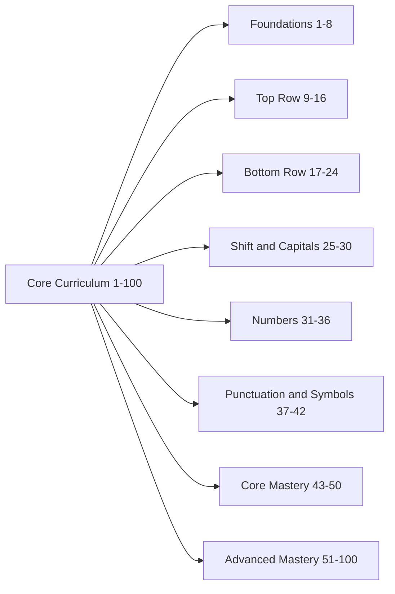
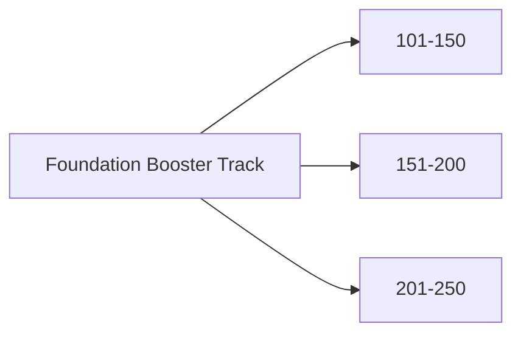

<div align="center">

# Typing Academy

A premium, lesson-first typewriting platform with **250 guided practices**, dual learning modes, modern UI, and local-first analytics.

[](https://react.dev/)
[](https://vitejs.dev/)
[](https://tailwindcss.com/)
[](https://reactrouter.com/)
[](https://fkhadra.github.io/react-toastify/)
[](#)
[](#curriculum)

</div>

---

## Why This Project

Typing Academy is built as a structured skill-building product, not a random typing test.

It focuses on:
- progressive learning from posture and home-row basics to full-flow typing
- real training metrics (WPM, accuracy, mistakes, progress)
- meaningful lesson progression with mission/unlocked modes
- premium responsive UI that works cleanly on mobile and desktop
- local persistence so learners can resume instantly

---

## Preview

### Core Experience
- Structured lessons with clear goals
- Real-time typing feedback and visual character states
- Result workflow with pass/retry navigation
- Dashboard analytics and milestone achievements

### Learning Modes
- **Mission Mode**: unlock lessons sequentially
- **Unlocked Mode**: access all lessons immediately

---

## Tech Stack

| Layer | Technologies |
|---|---|
| Frontend | React, Vite |
| Styling | Tailwind CSS |
| Routing | React Router |
| UI Feedback | React Icons, React Toastify, react-loader-spinner |
| Persistence | localStorage |
| State | React Context + Hooks |

---

## Quick Start

### 1) Clone

```bash
git clone https://github.com/Arbab-ofc/Typing-Academy.git
cd Typing-Academy
```

### 2) Install

```bash
npm install
```

### 3) Run Development Server

```bash
npm run dev
```

### 4) Build Production

```bash
npm run build
```

### 5) Preview Production Build

```bash
npm run preview
```

---

## Available Scripts

```bash
npm run dev      # run local Vite dev server
npm run build    # build production assets
npm run preview  # preview built output
npm run lint     # lint source files
```

---

## Routes

| Route | Purpose |
|---|---|
| `/` | Home and product overview |
| `/lessons` | Full lesson grid with filters and status |
| `/lessons/:lessonId` | Typing practice for a lesson |
| `/results/:lessonId` | Post-lesson result summary |
| `/dashboard` | Progress analytics and history |
| `/settings` | Theme, mode, panel/text, sound |
| `/about` | Typing help and guidance |

---

## Curriculum

Typing Academy currently includes **250 lessons**.

### Core Path (1-100)



### Foundation Booster Track (101-250)



### Phase Table

| Phase | Range | Focus |
|---|---|---|
| Foundations | 1-8 | posture, finger anchors, basic rhythm |
| Top Row | 9-16 | top-row reach and return control |
| Bottom Row | 17-24 | lower-row precision |
| Shift & Capitals | 25-30 | uppercase mechanics |
| Numbers | 31-36 | number-row confidence |
| Punctuation & Symbols | 37-42 | punctuation accuracy |
| Core Mastery | 43-50 | integrated practical typing |
| Advanced Mastery | 51-100 | speed + accuracy depth |
| Foundation Booster 1 | 101-150 | extra basic reinforcement |
| Foundation Booster 2 | 151-200 | extended basic drills |
| Foundation Booster 3 | 201-250 | high-volume foundation practice |

---

## Typing Engine

### Live Metrics
- elapsed time
- typed characters
- correct/incorrect character tracking
- mistakes count
- progress percentage
- WPM and accuracy

### Formulas
- **WPM** = `(typedCharacters / 5) / elapsedMinutes`
- **Accuracy** = `(correctCharacters / totalTypedCharacters) * 100`

### Behavior
- timer starts on first keypress
- supports backspace correction
- supports completion detection and result generation
- saves progress + updates unlock state on completion

---

## Local Storage Schema

| Key | Stores |
|---|---|
| `typing_academy_progress_v1` | completed/unlocked lessons, stats, history, achievements |
| `typing_academy_settings_v1` | theme, learning mode, sound, panel/text size |
| `typing_academy_recent_result_v1` | latest lesson result payload |

---

## Project Structure

```text
src/
  components/
    about/
    common/
    dashboard/
    home/
    layout/
    lessons/
    practice/
    settings/
  data/
    lessons.js
  hooks/
    useAcademyContext.js
    useAcademySettings.js
    useTypingAcademy.js
    useTypingSession.js
  pages/
    AboutPage.jsx
    DashboardPage.jsx
    HomePage.jsx
    LessonPracticePage.jsx
    LessonsPage.jsx
    ResultPage.jsx
    SettingsPage.jsx
  routes/
    AppRoutes.jsx
  styles/
    index.css
  utils/
    achievements.js
    constants.js
    progressSelectors.js
    storage.js
    typing.js
```

---

## UI / UX Design Notes

- responsive layout from mobile to desktop
- premium card hierarchy and visual rhythm
- full keyboard guide for key-location awareness
- light and dark theme support
- high-contrast, readable toast system

---

## Deployment

This is a frontend-only app and can be deployed to Vercel/Netlify/GitHub Pages.

### Production Output

```bash
npm run build
```

Deploy the generated `dist/` directory.

---

## Contributing

1. Fork repository
2. Create feature branch
3. Commit meaningful changes
4. Open pull request with clear context

---

If this project is useful, star the repository.
